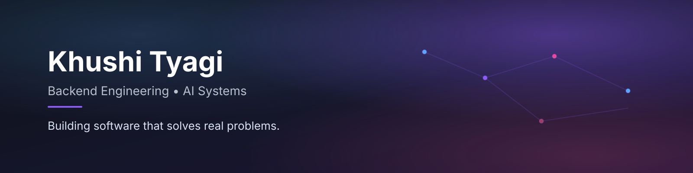

## Hi there 

I'm Khushi, a final-year Computer Science student who enjoys building software that people can depend on.

Most of my work has been in backend development, where I like designing APIs, thinking about system architecture, and understanding the trade-offs behind engineering decisions. Along the way, I've explored machine learning and LLM-based systems, but what keeps me interested is building software that's reliable, practical, and easy to improve.

---

## Currently Working On

- Building **LLM Cost Autopilot**, an intelligent routing system that reduces LLM inference costs by **79%**
- Exploring backend architecture and machine learning systems
- Learning more about evaluation pipelines, system design, and scalable software

---

## Featured Projects

### LLM Cost Autopilot

Built to answer a simple question:

> **Can every prompt justify using the most expensive model?**

An intelligent routing system that predicts prompt complexity and selects the most cost-effective LLM while maintaining response quality through selective verification.

**Highlights**

- Reduced inference costs by **79%**
- Random Forest prompt complexity classifier
- Multi-tier LLM routing engine
- Selective LLM verification
- Response caching
- FastAPI backend
- Dockerized deployment

**Tech**

`Python` • `FastAPI` • `Scikit-Learn` • `SQLite` • `Docker`

---

### MailBuddy

An intelligent email assistant that combines retrieval, classification, summarization, and response generation into a modular backend application.

**Highlights**

- Gmail integration
- Hybrid Retrieval (BM25 + FAISS)
- Retrieval-Augmented Generation
- Modular FastAPI architecture
- Confidence-based response generation

**Tech**

`Python` • `FastAPI` • `Streamlit` • `FAISS` • `Groq`

---

## Engineering Interests

| Area | Focus |
|------|-------|
| Backend Engineering | APIs, FastAPI, Async Programming, Databases |
| Machine Learning Systems | Classification, Evaluation, Intelligent Routing |
| LLM Applications | Retrieval, Prompt Engineering, Verification |
| Software Design | Modular Architecture, Testing, Maintainability |
| Performance | Optimization, Caching, Benchmarking |

---

## Tech Stack

### Languages

### Backend

### Machine Learning

`Scikit-Learn` • `Transformers` • `Sentence Transformers` • `FAISS` • `ChromaDB`

### Databases

### Tools

---

## What I Value

- Building software that's simple before making it complex
- Measuring improvements instead of assuming them
- Writing modular and maintainable code
- Learning by building and iterating

---

## GitHub Activity

---

## Let's Connect

